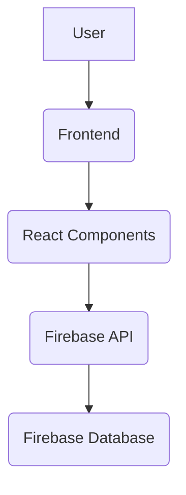
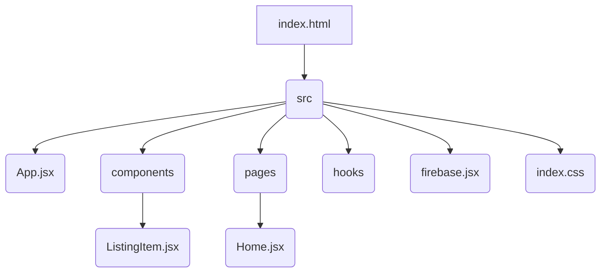

# Vistagate

> A full-stack web application for listing and managing properties. Built with React, Firebase, and Tailwind CSS.

[](https://www.npmjs.com/package/client)


## 📚 Table of Contents

- [Description](#description)
- [Tech Stack](#tech-stack)
- [Architecture Overview](#architecture-overview)
- [File Structure](#file-structure)
- [Features](#features)
- [Installation](#installation)
  - [Prerequisites](#prerequisites)
  - [Setup](#setup)
- [Usage](#usage)
  - [Execution Options](#execution-options)
- [Contributing](#contributing)
- [Contributors](#contributors)
- [License](#license)


## Description

Vistagate is a full-stack web application built using React for the frontend and Firebase for the backend.  It allows users to create, edit, and view property listings.  Key features include user authentication, property listing management, and a user-friendly interface. The application utilizes React components like `ListingItem`, `CreateListing`, and `EditListing` to manage property data.  The `firebase.jsx` file handles interaction with the Firebase backend.

## Tech Stack

[](https://reactjs.org/)
[](https://tailwindcss.com/)
[](https://firebase.google.com/)
[](https://developer.mozilla.org/en-US/docs/Web/JavaScript)
[](https://en.wikipedia.org/wiki/HTML5)
[](https://en.wikipedia.org/wiki/Cascading_Style_Sheets)
[](https://github.com/PIYUSH1SAINI/ReadMe-wiz.git)


## Architecture Overview



## File Structure



## Features

*   User authentication via OAuth.
*   Creation and editing of property listings.
*   Detailed property listing pages.
*   User profile management.
*   Search and filtering of listings by category.
*   Responsive design for various screen sizes.


## Installation

### Prerequisites

> [!NOTE]
> Node.js >=14 and npm are required.


### Setup

1.  **Clone Repository**: Clone the repository from GitHub and set up the project locally.
    ```bash
    git clone https://github.com/raghavG0212/Vistagate.git
    cd Vistagate
    npm install
    ```

> [!TIP]
> Use the `git clone` method for the quickest setup.


## Usage

### Execution Options

#### Frontend Execution

To start the development server, run:

```bash
npm run dev
```

This will open the application in your browser and begin watching for changes.

> [!IMPORTANT]
> Ensure you have a Firebase project set up and configured correctly before running the application.

## Contributing

Contributions are welcome! Please open an issue or submit a pull request.

## Contributors

<a href="https://github.com/raghavG0212" target="_blank"></a>

## License

MIT License


<a href="https://github.com/PIYUSH1SAINI/ReadMe-wiz.git" target="_blank">
      
    </a>
